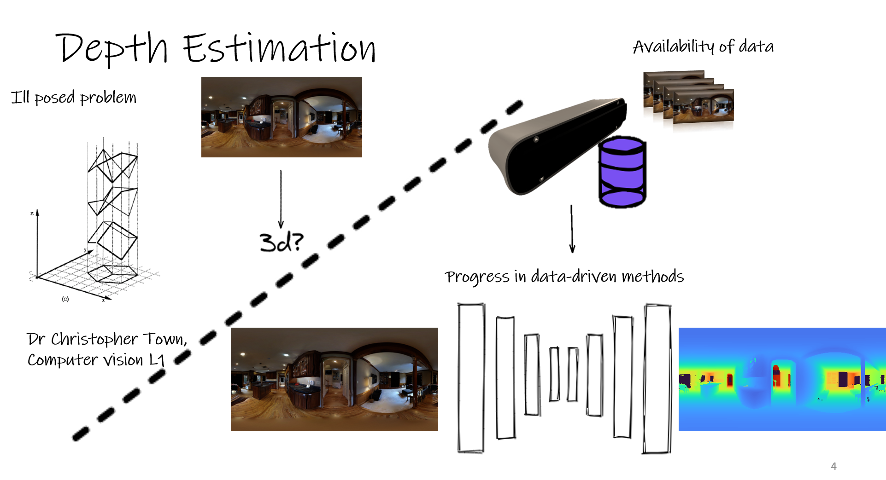
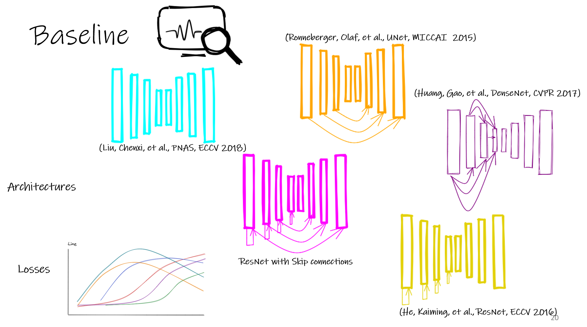

# Pano3D Demo
This web-page provides a brief 

## Background

### Problem 
Monocular depth estimation is the task of inferring a per-pixel depth map from a single RGB image, information that can be used to infer scene’s geometry applied in several downstream tasks (i.e. 3d reconstruction, floorplan generation, virtual tour, etc.).

However, monocular depth estimation is a challenging, ill-posed problem, meaning that several 3D scenes can correspond to the same 2D image.
The recent advances in the deep-learning domain, alongside the availability of data have been crucial for enabling progress in the domain.

On the other hand the availability of data has enabled progress in data-driven methods, achieving great results in the monocular depth estimation task/

### Solution
Pano3D benchmark allows us to thoroughly explore recent advances and standard practises alike to search for a solid baseline, and also assess various common or recent techniques.
Initially we benchmark different architectures using various losses to identify which combinations make for the best models in an intra-architecture scheme.
Then, we use the best models of each architecture to perform an inter-architecture benchmarking to identify the best performers.

## Demo
